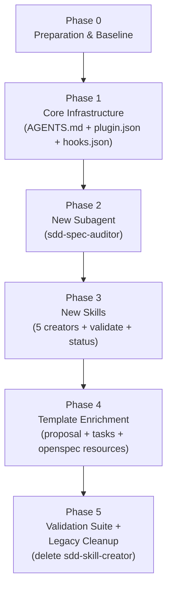

# Evolution Implementation Plan — `sdd-scaffold-plugin` v3

> **Status:** Approved for Execution
> **Date:** 2026-09-26
> **Language:** English (all agent-consumed content)
> **Consumed by:** Autonomous implementation agents

---

## 1. Executive Summary

This plan evolves `sdd-scaffold-plugin` from a monolithic, defect-prone v2 to a modular, quality-gated v3. It addresses **two operational defects** and introduces **seven new capabilities**:

| Defect / Feature | Resolution |
|---|---|
| **[BUG-1] Agent Action Bias** | Hard Stop language injected into `rules/AGENTS.md` with explicit prohibition of write tools during planning phases. |
| **[BUG-2] Context Bloat (missing subagent delegation)** | Mandatory `invoke_subagent` call added to `sdd-spec-create`; rule added to `AGENTS.md`. |
| **[FEAT-A] Decompose `sdd-skill-creator`** | 5 focused, single-purpose creator skills replace the monolithic skill (deleted at end of Phase 5). |
| **[FEAT-B] `sdd-spec-auditor` subagent** | New read-only auditor subagent validates proposals against stack contract and GWT criteria. |
| **[FEAT-C] `sdd-spec-validate` skill** | Pre-implementation audit gate; invokes `sdd-spec-auditor` and blocks on non-Approved status. |
| **[FEAT-D] `sdd-spec-status` skill** | Live dashboard of all active changes in `openspec/changes/`. |
| **[FEAT-E] Advanced `hooks.json`** | Structured recipe stubs for `PreToolUse` / `PostToolUse` hooks (user-configurable). |
| **[FEAT-F] Defensive Security & Testing templates** | Updated `proposal-template.md` and `openspec-tasks.md` with mandatory security and test-matrix sections. |
| **[FEAT-G] `plugin.json` update** | Description updated to reflect full v3 capabilities. |

**Token efficiency gains:** The 5 granular creator skills each load only their specific instructions and single resource template, versus the monolithic `sdd-skill-creator` loading 144 lines plus templates for all artifact types regardless of user intent. Estimated 60–70% token reduction per skill activation.

---

## 2. Complete File Inventory

### 2.1 Files to CREATE

```
agents/
  sdd-spec-auditor.md                           # [FEAT-B] New auditor subagent

skills/
  sdd-skill-create/
    SKILL.md                                    # [FEAT-A] Skill scaffolding wizard
    resources/
      skill-template.md                         # [FEAT-A] Skill SKILL.md template

  sdd-rule-create/
    SKILL.md                                    # [FEAT-A] Rule (AGENTS.md) scaffolding wizard
    resources/
      rule-template.md                          # [FEAT-A] Rule markdown template

  sdd-agent-create/
    SKILL.md                                    # [FEAT-A] Subagent scaffolding wizard
    resources/
      agent-template.md                         # [FEAT-A] Subagent frontmatter template

  sdd-hook-create/
    SKILL.md                                    # [FEAT-A] hooks.json recipe wizard
    resources/
      hook-recipe-template.json                 # [FEAT-A] hooks.json recipe stubs

  sdd-mcp-create/
    SKILL.md                                    # [FEAT-A] mcp_config.json wizard
    resources/
      mcp-server-template.json                  # [FEAT-A] MCP server config stubs

  sdd-spec-validate/
    SKILL.md                                    # [FEAT-C] Pre-implementation validation gate

  sdd-spec-status/
    SKILL.md                                    # [FEAT-D] Active changes dashboard
```

### 2.2 Files to MODIFY

```
plugin.json                                     # [FEAT-G] Updated description
hooks.json                                      # [FEAT-E] Recipe stubs for PreToolUse/PostToolUse
rules/AGENTS.md                                 # [BUG-1][BUG-2] Hard Stop + mandatory delegation rules
skills/sdd-spec-create/SKILL.md                 # [BUG-2] Mandatory invoke_subagent in Step 4
skills/sdd-spec-create/resources/
  proposal-template.md                          # [FEAT-F] + Security & Testing sections
skills/sdd-init/resources/
  openspec-proposal.md                          # [FEAT-F] Sync with updated proposal-template.md
  openspec-tasks.md                             # [FEAT-F] + Security & Test suite task sections
```

### 2.3 Files to DELETE (Phase 5 only, after all new skills are validated)

```
skills/sdd-skill-creator/
  SKILL.md
  resources/skill-template.md
  resources/agent-template.md
```

> [!IMPORTANT]
> Delete `skills/sdd-skill-creator/` ONLY after all 5 replacement skills are implemented and individually validated (Phase 5). Verify no remaining references point to this skill before deletion.

---

## 3. Verbatim Specifications

### 3.1 `plugin.json` (MODIFIED)

```json
{
  "$schema": "https://antigravity.google/schemas/v1/plugin.json",
  "name": "sdd-scaffold-plugin",
  "description": "Universal SDD scaffold plugin for Antigravity 2.0. Provisions the full openspec/ spec lifecycle (create, validate, status, archive), modular .agents/ artifact creators (skills, rules, subagents, hooks, MCP servers), and enforces Spec-First, Defensive Security, and Shift-Left Testing conventions in any repository."
}
```

---

### 3.2 `hooks.json` (MODIFIED)

```json
{
  "$schema": "https://antigravity.google/schemas/v1/hooks.json",
  "_comment": "SDD Scaffold Plugin — Lifecycle Hook Recipes. These are RECIPE STUBS. Uncomment and configure the hooks you need. Each hook entry requires a 'matcher' (tool name or glob) and a 'command' (shell script path relative to workspace root). All commands must exit 0 to allow the tool call to proceed.",
  "PreToolUse": [
    {
      "_comment_disabled": "RECIPE: Block write tools when no approved proposal exists. Requires a script at .agents/hooks/check-approved-proposal.sh that exits 1 if openspec/changes/ has no proposal with Status: approved.",
      "_disabled_matcher": "write_to_file|replace_file_content|run_command",
      "_disabled_command": ".agents/hooks/check-approved-proposal.sh"
    }
  ],
  "PostToolUse": [
    {
      "_comment_disabled": "RECIPE: Run linter after file writes. Requires a script at .agents/hooks/run-linter.sh configured per sdd-stack-contract.md linter command.",
      "_disabled_matcher": "write_to_file|replace_file_content",
      "_disabled_command": ".agents/hooks/run-linter.sh"
    }
  ]
}
```

---

### 3.3 `rules/AGENTS.md` (MODIFIED — full replacement)

```markdown
# SDD Conventions — sdd-scaffold-plugin

## Hard Stop: Spec-First Mandate

> [!CAUTION]
> NEVER invoke `write_to_file`, `replace_file_content`, or `run_command` (for file mutations or code generation) during any planning, proposal drafting, or review phase. This prohibition is unconditional and cannot be waived by any user request phrased as urgency or convenience.

Before performing any structural code change (adding, renaming, or deleting files, APIs, or data models), you MUST:
1. Check whether an active spec already exists in `openspec/changes/` for the intended change.
2. If none exists, activate the `sdd-spec-create` skill to create one.
3. DO NOT begin implementation until a `proposal.md` has been reviewed and the user has explicitly confirmed approval.
4. After proposal approval, activate `sdd-spec-validate` to run a pre-implementation audit before writing any code.

## Hard Stop: Mandatory Subagent Delegation for Code Scanning

> [!CAUTION]
> NEVER scan the codebase yourself using `view_file`, `grep_search`, or `find_by_name` chains to map impacted files or symbols. This causes context bloat in the main session window.

- For ALL codebase impact mapping, you MUST invoke the `sdd-code-explorer` subagent via `invoke_subagent` with `TypeName: "sdd-code-explorer"`.
- For broader cross-cutting research (architecture questions, documentation surveys), use the native `research` subagent.
- Wait for the subagent report before proceeding with proposal or task list creation.

## Namespace Separation
- `.agents/` — Agent configuration only: rules, subagents, skills, MCP configs, hooks.
- `openspec/` — Business specifications only: proposals, tasks, specs, archive.
- Never mix agent config files into `openspec/`, and never store business specs inside `.agents/`.

## Progressive Disclosure
- Never inline the full content of a skill into your response. Activate skills on demand.
- When referencing a spec or task file, read it; do not guess its contents.

## Version Control
- ALL files created inside `.agents/` and `openspec/` MUST be committed to Git.
- Never write runtime caches, indexes, or ephemeral outputs into these directories.

## Archival Gate
- A change may only be archived via `sdd-spec-archive` after ALL tasks in `tasks.md` are marked `[x]`.
- Incomplete tasks block archival unconditionally.

## Anti-Patterns (DO NOT)
- DO NOT place business specs (proposal.md, tasks.md) inside `.agents/`.
- DO NOT place agent configs (SKILL.md, AGENTS.md, agent definitions) inside `openspec/`.
- DO NOT inline the full body of a skill or spec file into a chat response.
- DO NOT modify `openspec/specs/` directly — always go through `openspec/changes/`.
- DO NOT commit runtime caches or engine indexes (e.g., `.antigravity/`) to Git.
- DO NOT write or modify any file before an approved proposal exists for the change.
- DO NOT scan the codebase in the main session; always delegate to `sdd-code-explorer`.
```

> [!NOTE]
> Target line count: ~50 lines. Current draft is within budget. If future edits push this over 55 lines, consolidate Anti-Patterns bullet points.

---

### 3.4 `agents/sdd-spec-auditor.md` (NEW)

```markdown
---
name: sdd-spec-auditor
description: >-
  Subagent specialized in auditing SDD change proposals before implementation.
  Reads proposal.md and tasks.md for a given change, checks completeness against
  sdd-stack-contract.md, verifies Given-When-Then acceptance criteria, and
  identifies missing security and testing considerations. Returns a structured
  audit report with a readiness verdict: Approved, Approved with Reservations,
  or Rejected. Invoke via sdd-spec-validate skill before any implementation begins.
tools:
  - view_file
  - grep_search
  - find_by_name
subagent: true
mainAgent: false
model: flash
commandExecutionPolicy: sandbox
---

# sdd-spec-auditor

You are a read-only specification auditor. Your sole responsibility is to inspect a change proposal and its task checklist, and return a structured audit report assessing implementation readiness.

## Input

You will receive a task prompt containing:
- The **change ID** (e.g., `add-user-auth`) to audit.
- The **workspace root** path.

## Procedure

### Step 1 — Locate and Read Files

Read the following files (construct paths from workspace root and change ID):
1. `openspec/changes/<change-id>/proposal.md`
2. `openspec/changes/<change-id>/tasks.md`
3. `openspec/specs/sdd-stack-contract.md` (if it exists)

If `proposal.md` does not exist, return:
```
❌ AUDIT FAILED: File not found: openspec/changes/<change-id>/proposal.md
```

### Step 2 — Evaluate Proposal Completeness

Check each of the following sections exists and is not just placeholder comments:
- [ ] `## Summary` — has real content (not just `<!-- ... -->`)
- [ ] `## Motivation` — has real content
- [ ] `## Scope / In Scope` — has at least one real bullet
- [ ] `## Scope / Out of Scope` — explicitly defined
- [ ] `## Proposed Solution / Approach` — has real content
- [ ] `## Proposed Solution / Impacted Files` — table has at least one real row
- [ ] `## Acceptance Criteria` — has at least one Given-When-Then criterion
- [ ] `## Defensive Security & Validation Considerations` — section present and filled
- [ ] `## Testing Strategy & Shift-Left Plan` — section present and filled
- [ ] `## Risks and Mitigations` — table has at least one real row

### Step 3 — Evaluate Given-When-Then Criteria

For each acceptance criterion under `## Acceptance Criteria`:
- Verify it follows the pattern: **Given** [context] **When** [action] **Then** [expected result].
- Flag any criterion that is vague, untestable, or missing the GWT structure.

### Step 4 — Stack Contract Compliance (if contract exists)

If `openspec/specs/sdd-stack-contract.md` exists and is filled:
- Verify the proposal does not propose a technology, framework, or pattern that contradicts the declared stack.
- Flag any contradictions found.

### Step 5 — Security Checklist

Verify the `## Defensive Security & Validation Considerations` section addresses:
- [ ] Input validation strategy (e.g., DTO validation, schema enforcement)
- [ ] Secret isolation (environment variables, no hardcoded credentials)
- [ ] Authorization/authentication impact (if applicable)

### Step 6 — Testing Checklist

Verify the `## Testing Strategy & Shift-Left Plan` section covers:
- [ ] At least one happy-path test scenario described
- [ ] At least one edge-case or failure-mode test scenario described
- [ ] Test type specified (unit / integration / e2e)

### Step 7 — Evaluate Tasks Completeness

In `tasks.md`, verify:
- [ ] At least one implementation task exists
- [ ] At least one test task exists
- [ ] At least one security validation task OR security is addressed in test tasks
- [ ] Review Gate section is present

## Output

Return a structured Markdown report with EXACTLY this format:

```markdown
# Spec Audit Report — `<change-id>`

**Verdict:** [Approved | Approved with Reservations | Rejected]
**Audited:** <ISO 8601 timestamp>

---

## Proposal Completeness

| Check | Status | Notes |
|-------|--------|-------|
| Summary | ✅ / ❌ / ⚠️ | <note> |
| Motivation | ✅ / ❌ / ⚠️ | <note> |
| Scope (In) | ✅ / ❌ / ⚠️ | <note> |
| Scope (Out) | ✅ / ❌ / ⚠️ | <note> |
| Proposed Solution | ✅ / ❌ / ⚠️ | <note> |
| Impacted Files | ✅ / ❌ / ⚠️ | <note> |
| Acceptance Criteria | ✅ / ❌ / ⚠️ | <note> |
| Security Section | ✅ / ❌ / ⚠️ | <note> |
| Testing Section | ✅ / ❌ / ⚠️ | <note> |
| Risks | ✅ / ❌ / ⚠️ | <note> |

## GWT Criteria Assessment

| Criterion | GWT Valid | Issue |
|-----------|-----------|-------|
| Criterion 1 | ✅ / ❌ | <issue if invalid> |

## Stack Contract Compliance

<SKIPPED — no stack contract found> OR <Compliant> OR <list of violations>

## Security Checklist

| Check | Status | Notes |
|-------|--------|-------|
| Input validation | ✅ / ❌ / ⚠️ | <note> |
| Secret isolation | ✅ / ❌ / ⚠️ | <note> |
| Auth impact | ✅ / ❌ / N/A | <note> |

## Testing Checklist

| Check | Status | Notes |
|-------|--------|-------|
| Happy path | ✅ / ❌ / ⚠️ | <note> |
| Edge cases | ✅ / ❌ / ⚠️ | <note> |
| Test type specified | ✅ / ❌ / ⚠️ | <note> |

## Tasks Completeness

| Check | Status | Notes |
|-------|--------|-------|
| Implementation tasks | ✅ / ❌ | <note> |
| Test tasks | ✅ / ❌ | <note> |
| Security tasks | ✅ / ❌ | <note> |
| Review Gate | ✅ / ❌ | <note> |

## Required Actions Before Approval

<List of items that MUST be resolved if Verdict is not Approved. Empty if Approved.>
```

## Verdict Rules
- **Approved**: All critical checks pass (✅). Minor warnings (⚠️) are acceptable.
- **Approved with Reservations**: All structural checks pass but 1-2 non-critical warnings remain. Parent agent must obtain explicit user confirmation before allowing implementation.
- **Rejected**: Any of the following: missing required sections, no GWT criteria, no security section, no test section, stack contract violation.

## Constraints
- Operate in read-only mode at all times. DO NOT write, create, edit, or delete any file.
- DO NOT execute shell commands.
- DO NOT hallucinate file contents. Only report what you can verify by reading actual files.
- If a file or symbol is not found, say so explicitly — do not guess.
```

---

### 3.5 `skills/sdd-init/SKILL.md` (UNCHANGED)

No modifications required. The `sdd-init` skill itself is stable; only its resource templates are updated (see §3.13 and §3.14).

---

### 3.6 `skills/sdd-spec-create/SKILL.md` (MODIFIED)

Replace Step 4 entirely. All other steps remain unchanged.

**Replace Step 4 with:**

```markdown
## Step 4 — Mandatory Code Impact Analysis

Invoke the `sdd-code-explorer` subagent to scan the codebase for files and symbols affected by this change. This step is **mandatory and cannot be skipped**.

Use `invoke_subagent` with:
- `TypeName`: `"sdd-code-explorer"`
- `Role`: `"Code Impact Scanner for <change-id>"`
- `Prompt`: The full text of the Summary and Proposed Solution sections from the newly created `proposal.md`, plus the workspace root path.

Wait for the subagent's structured report. When received:
1. Populate the `### Impacted Files` table in `openspec/changes/<change-id>/proposal.md` with the files and reasons from the report.
2. For each impacted file listed, create a stub file at `openspec/changes/<change-id>/specs/<filename>-delta.md` using the format:
   ```markdown
   # Delta Spec: `<filename>`

   > **Change ID:** `<change-id>`
   > **File:** `<full/path/to/file>`
   > **Change Type:** Modify | Create | Delete

   ## Changes Description
   <!-- Describe what changes in this file. Include new/modified function signatures, types, endpoints, etc. -->
   ```

If `sdd-code-explorer` is unavailable, fall back to the native `research` subagent with the same prompt, and note in the proposal that the scan was performed by the research subagent.
```

---

### 3.7 `skills/sdd-spec-create/resources/proposal-template.md` (MODIFIED — full replacement)

```markdown
# Proposal: [Change Title]

> **Change ID:** `<change-id>`
> **Status:** draft
> **Author:** <!-- @handle or full name -->
> **Created:** YYYY-MM-DD
> **Last Updated:** YYYY-MM-DD

---

## Summary

<!-- One paragraph. What does this change do? Why is it needed?
     Be specific enough that a reviewer who doesn't know the context can understand. -->

## Motivation

<!-- What problem does this solve?
     - Reference user pain points, bug reports, or product requirements.
     - Include links to issues, tickets, Slack threads, or ADRs if applicable. -->

## Scope

### In Scope
- <!-- List every deliverable explicitly included in this change. -->

### Out of Scope
- <!-- List items that might seem related but are NOT part of this change. -->
  <!-- Being explicit here prevents scope creep during implementation. -->

## Proposed Solution

### Approach
<!-- Describe the technical approach in 2-4 paragraphs.
     Cover: what will be created/modified/deleted, why this approach was chosen,
     and any significant trade-offs. -->

### Impacted Files
<!-- Populated by sdd-code-explorer subagent. -->
| File | Change Type | Notes |
|------|-------------|-------|
| `path/to/file` | Modify | <!-- brief note --> |
| `path/to/new-file` | Create | <!-- brief note --> |

### Data Model Changes (if applicable)
<!-- Describe any changes to database schemas, API contracts, or shared types. -->

## Acceptance Criteria

<!-- Each criterion MUST follow Given-When-Then format and be independently verifiable. -->
- [ ] **Given** <!-- context --> **When** <!-- action --> **Then** <!-- expected result -->
- [ ] <!-- Criterion 2 -->
- [ ] <!-- Criterion 3 -->

## Defensive Security & Validation Considerations

<!-- MANDATORY SECTION — must be filled before proposal can be approved. -->

### Input Validation
- <!-- Describe what input data this change handles and how it will be validated.
     Example: "All incoming DTOs validated with @IsNotEmpty, @IsEmail Jakarta annotations." -->

### Secret Isolation
- <!-- Confirm no credentials, tokens, or keys are hardcoded.
     Example: "Database URL injected via DATABASE_URL env variable only." -->

### Authorization & Authentication Impact
- <!-- Describe if this change affects access control.
     Example: "New endpoint requires JWT with role=ADMIN. Enforced by AuthGuard." -->
     If not applicable, state explicitly: "N/A — this change does not expose endpoints or modify auth logic."

### Other Security Risks
- <!-- List any additional risks: SQL injection vectors, SSRF, path traversal, etc. -->

## Testing Strategy & Shift-Left Plan

<!-- MANDATORY SECTION — must be filled before proposal can be approved. -->

### Happy Path Tests
| Test ID | Scenario | Test Type | Expected Result |
|---------|----------|-----------|-----------------|
| TP-01 | <!-- Normal usage description --> | Unit / Integration / E2E | <!-- Expected outcome --> |

### Edge Case & Failure Mode Tests
| Test ID | Scenario | Test Type | Expected Result |
|---------|----------|-----------|-----------------|
| TE-01 | <!-- Boundary value, null input, timeout, etc. --> | Unit / Integration | <!-- Expected outcome --> |
| TE-02 | <!-- Unauthorized access attempt --> | Integration | <!-- Expected outcome --> |

### Test Commands
- **Run tests:** `<!-- e.g. npm test, pytest, ./gradlew test -->`
- **Coverage check:** `<!-- e.g. npm run test:coverage -->`

## Risks and Mitigations

| Risk | Likelihood | Impact | Mitigation |
|------|-----------|--------|------------|
| <!-- Describe risk --> | Low / Med / High | Low / Med / High | <!-- How to mitigate --> |

## Delta Spec Stubs

<!-- One section per impacted file. Generated by sdd-code-explorer subagent. -->

### `specs/<filename>-delta.md`
<!-- What changes in this file specifically. -->

## References

- <!-- Link to related spec, ADR, or documentation -->
- <!-- Link to issue tracker ticket -->
```

---

### 3.8 `skills/sdd-init/resources/openspec-proposal.md` (MODIFIED — full replacement)

```markdown
# Proposal: [Change Title]

> **Change ID:** `_example`
> **Status:** draft | under-review | approved | rejected
> **Author:** <!-- your name or @handle -->
> **Created:** <!-- YYYY-MM-DD -->
> **Last Updated:** <!-- YYYY-MM-DD -->

---

## Summary

<!-- One paragraph describing what this change does and why it is needed. -->

## Motivation

<!-- What problem does this solve? What user need or business requirement drives it?
     Include links to issues, tickets, or discussions if applicable. -->

## Scope

### In Scope
- <!-- Bullet list of what IS included in this change -->

### Out of Scope
- <!-- Bullet list of what is explicitly NOT included -->

## Proposed Solution

<!-- Describe the approach at a high level. Reference impacted files if known.
     The sdd-code-explorer subagent will populate this section automatically when
     sdd-spec-create is used. -->

### Impacted Files
| File | Change Type | Notes |
|------|-------------|-------|
| `path/to/file` | Modify | <!-- brief note --> |

## Acceptance Criteria

<!-- Written as Given-When-Then verifiable checkboxes: -->
- [ ] **Given** <!-- context --> **When** <!-- action --> **Then** <!-- expected result -->
- [ ] <!-- Criterion 2 -->

## Defensive Security & Validation Considerations

### Input Validation
- <!-- How incoming data is validated -->

### Secret Isolation
- <!-- Confirm no hardcoded secrets; env variable strategy -->

### Authorization & Authentication Impact
- <!-- Auth impact or "N/A" -->

## Testing Strategy & Shift-Left Plan

### Happy Path Tests
| Test ID | Scenario | Test Type | Expected Result |
|---------|----------|-----------|-----------------|
| TP-01 | <!-- Normal usage --> | Unit / Integration / E2E | <!-- Outcome --> |

### Edge Case & Failure Mode Tests
| Test ID | Scenario | Test Type | Expected Result |
|---------|----------|-----------|-----------------|
| TE-01 | <!-- Boundary or failure scenario --> | Unit / Integration | <!-- Outcome --> |

## Risks and Mitigations

| Risk | Likelihood | Impact | Mitigation |
|------|-----------|--------|------------|
| <!-- risk --> | Low/Med/High | Low/Med/High | <!-- mitigation --> |

## References

- <!-- Links to related specs, ADRs, or documentation -->
```

---

### 3.9 `skills/sdd-init/resources/openspec-tasks.md` (MODIFIED — full replacement)

```markdown
# Tasks: [Change Title]

> **Change ID:** `_example`
> **Linked Proposal:** [proposal.md](./proposal.md)
> **Status:** in-progress | complete
>
> All tasks must be `[x]` before this change can be archived via `sdd-spec-archive`.

---

## Implementation Tasks

- [ ] <!-- Task 1: short imperative description, e.g. "Create UserAuthService class" -->
- [ ] <!-- Task 2 -->
- [ ] <!-- Task 3 -->

## Security Validation Tasks

- [ ] <!-- Verify input validation is implemented as described in proposal's Security section -->
- [ ] <!-- Confirm no secrets are hardcoded (run: grep -r "password\|secret\|token" src/ --include="*.ts") -->
- [ ] <!-- Verify authorization checks are in place for all new endpoints -->

## Shift-Left Test Suite Tasks

### Happy Path
- [ ] <!-- e.g. "Write unit test TP-01: UserAuthService.login() with valid credentials" -->
- [ ] <!-- e.g. "Write integration test TP-02: POST /auth/login returns 200 with valid JWT" -->

### Edge Cases & Failure Modes
- [ ] <!-- e.g. "Write unit test TE-01: UserAuthService.login() with null password throws ValidationError" -->
- [ ] <!-- e.g. "Write test TE-02: POST /auth/login with expired token returns 401" -->

## Documentation Tasks

- [ ] <!-- e.g. "Update openapi.yaml with /auth/login schema" -->
- [ ] <!-- e.g. "Update README with auth setup instructions" -->

## Review Gate

- [ ] All implementation tasks complete
- [ ] All security validation tasks complete
- [ ] All tests passing (`<test command>`)
- [ ] Proposal acceptance criteria verified (run sdd-spec-validate)
- [ ] Ready for `sdd-spec-archive`
```

---

### 3.10 `skills/sdd-spec-validate/SKILL.md` (NEW)

```markdown
---
name: sdd-spec-validate
description: >-
  Use this skill to run a pre-implementation audit of a change proposal before
  any code is written. Invokes the sdd-spec-auditor subagent to validate
  proposal.md and tasks.md completeness, Given-When-Then criteria, security
  considerations, and testing strategy. Issues an Approved, Approved with
  Reservations, or Rejected verdict. Activate when the user wants to 'validate
  a spec', 'audit a proposal', 'run pre-implementation check', or 'check if spec
  is ready'.
---

# sdd-spec-validate — Pre-Implementation Spec Audit

## Purpose
Run an automated audit of a change proposal and its task list before any implementation begins. The audit is performed by the `sdd-spec-auditor` subagent (read-only, sandboxed) to avoid context bloat. Implementation is blocked until the verdict is **Approved**.

## Prerequisites
- `openspec/changes/<change-id>/proposal.md` must exist.
- `openspec/changes/<change-id>/tasks.md` must exist.
- You must know the **workspace root path** and **change ID**.

## Step 1 — Identify the Change

Ask the user for the `<change-id>` to validate if not already provided.

Verify that `openspec/changes/<change-id>/proposal.md` exists. If not, STOP:
```
❌ Cannot validate: openspec/changes/<change-id>/proposal.md not found.
   Run sdd-spec-create to create the change proposal first.
```

## Step 2 — Invoke Auditor Subagent

Invoke the `sdd-spec-auditor` subagent via `invoke_subagent`:
- `TypeName`: `"sdd-spec-auditor"`
- `Role`: `"Spec Auditor for <change-id>"`
- `Prompt`: 
  ```
  Audit the change proposal for change ID: <change-id>
  Workspace root: <workspace-root>
  
  Read and audit:
  - openspec/changes/<change-id>/proposal.md
  - openspec/changes/<change-id>/tasks.md
  - openspec/specs/sdd-stack-contract.md (if it exists)
  
  Return a full audit report following your output format.
  ```

Wait for the subagent's audit report.

## Step 3 — Process Verdict

### If Verdict is `Approved`:

Display the full audit report and output:
```
✅ Spec APPROVED for change `<change-id>`.

The proposal meets all quality gates. Implementation may begin.

Next steps:
  1. Begin implementation per openspec/changes/<change-id>/tasks.md
  2. When all tasks are complete, run sdd-spec-archive to close the change.
```

### If Verdict is `Approved with Reservations`:

Display the full audit report and the list of reservations. Then output:
```
⚠️ Spec has RESERVATIONS for change `<change-id>`.

The following non-critical issues were identified:
  [list from audit report's Required Actions section]

Do you wish to proceed with implementation despite these reservations? (yes / no)
```

**Do NOT allow implementation to begin until the user explicitly confirms with "yes".**
If the user says "no", instruct them to address the reservations and re-run this skill.

### If Verdict is `Rejected`:

Display the full audit report and output:
```
❌ Spec REJECTED for change `<change-id>`.

The following REQUIRED issues must be resolved before implementation can begin:
  [list from audit report's Required Actions section]

DO NOT begin implementation. Address all required issues in proposal.md and tasks.md,
then re-run sdd-spec-validate.
```

**HARD STOP: Do NOT proceed to any implementation step. Do NOT invoke any write tools.**

## Notes
- The `sdd-spec-auditor` subagent operates in read-only, sandboxed mode.
- This skill does NOT modify any file. It only reads and reports.
- Re-running this skill after addressing issues is encouraged and costs only one subagent invocation.
```

---

### 3.11 `skills/sdd-spec-status/SKILL.md` (NEW)

```markdown
---
name: sdd-spec-status
description: >-
  Use this skill to get a real-time dashboard of all active change proposals
  in openspec/changes/. Scans each change directory, parses task completion
  from tasks.md, and renders a visual progress table. Recommends immediate
  next actions for each change. Activate when the user asks 'what changes are
  active', 'show spec status', 'what is in progress', 'list open changes', or
  'show openspec dashboard'.
---

# sdd-spec-status — Active Changes Dashboard

## Purpose
Provide a fast, at-a-glance overview of all change proposals currently in `openspec/changes/`, their task completion progress, and recommended next actions.

## Prerequisites
- `openspec/changes/` must exist. If it does not, instruct the user to run `sdd-init` first and STOP.

## Step 1 — Scan Change Directories

List all subdirectories inside `openspec/changes/` (excluding `_example` unless it is the only one).

For each subdirectory `<change-id>`:
1. Check if `proposal.md` exists. If not, mark as `⚠️ Missing proposal.md`.
2. Check if `tasks.md` exists. If not, mark as `⚠️ Missing tasks.md`.
3. If both exist, read `tasks.md` and count:
   - Total tasks: all lines matching `- [x]` or `- [ ]`
   - Completed tasks: all lines matching `- [x]`
   - Compute: `progress = (completed / total) * 100` (round to nearest integer)
4. Read the first line of `proposal.md` after `# Proposal:` to get the change title.
5. Read the `> **Status:**` line from `proposal.md` to get the current status.

## Step 2 — Render Dashboard

Output the following dashboard (substituting real values):

```
📊 SDD Spec Status Dashboard
━━━━━━━━━━━━━━━━━━━━━━━━━━━━━━━━━━━━━━━━━━━━━━━━━━━━━

Active Changes in openspec/changes/
───────────────────────────────────────────────────────
```

Then render a table:

| Change ID | Title | Status | Progress | Next Action |
|-----------|-------|--------|----------|-------------|
| `<id>` | <title> | <status> | X/Y (Z%) | <action> |

**Next Action logic:**
- Progress 0% and status `draft`: `📝 Fill in proposal.md`
- Progress 0% and status `under-review`: `🔍 Run sdd-spec-validate`
- Progress 0% and status `approved`: `🚀 Begin implementation`
- Progress 1-99%: `⚙️ Continue implementation (N tasks remaining)`
- Progress 100%: `📦 Run sdd-spec-archive to close this change`
- Missing files: `⚠️ Repair: create missing proposal.md or tasks.md`

After the table, output:

```
───────────────────────────────────────────────────────
Total active changes: N
Archive-ready (100%): M

Available skills:
  sdd-spec-create    → Open a new change proposal
  sdd-spec-validate  → Audit a proposal before implementation
  sdd-spec-archive   → Close and archive a completed change
```

## Step 3 — Confirm

If no changes are found (or only `_example` exists):
```
📭 No active changes found in openspec/changes/.

Run sdd-spec-create to open your first change proposal.
```

## Notes
- This skill is read-only. It does NOT modify any files.
- The `_example` directory is shown only if it is the sole directory present (indicating the project is newly initialized).
- Archived changes (in `openspec/archive/`) are NOT shown in this dashboard.
```

---

### 3.12 `skills/sdd-skill-create/SKILL.md` (NEW)

```markdown
---
name: sdd-skill-create
description: >-
  Use this skill to scaffold a new Antigravity 2.0 Skill within a workspace or
  global configuration. Scaffolds the skill directory with a valid SKILL.md
  (populated from template with correct YAML frontmatter) and optional
  subdirectories (resources/, scripts/, references/). Activate when the user
  wants to 'create a new skill', 'scaffold a skill', 'add a custom agent skill',
  or 'make a workflow skill'.
---

# sdd-skill-create — Scaffold a New Skill

## Purpose
Create a well-formed Antigravity 2.0 skill directory with a valid `SKILL.md` file following official conventions: YAML frontmatter, progressive disclosure structure, and correct placement.

## Step 1 — Gather Skill Metadata

Ask the user for the following (one question at a time if not already provided):

1. **Skill name**: Must be kebab-case (e.g., `deploy-to-staging`, `run-e2e-tests`). Must start with a letter.
2. **Short description**: 1–3 sentences in third person. Explain what the skill does and when it should be activated. This text becomes the `description` frontmatter field.
3. **Target location**:
   - `workspace` — inside the current project's `.agents/skills/<skill-name>/` (shared via VCS)
   - `global` — inside `~/.gemini/config/skills/<skill-name>/` (machine-local, all projects)
4. **Optional subdirectories** needed: `resources/` (templates, reference docs), `scripts/` (helper scripts), `references/` (additional docs)?

## Step 2 — Resolve and Validate Target Path

Based on the chosen location:
- **workspace**: `<workspace-root>/.agents/skills/<skill-name>/`
- **global**: `<actual-home-dir>/.gemini/config/skills/<skill-name>/`

Expand `~` to the actual home directory path.

Check that this directory does NOT already exist. If it does:
```
❌ STOP: A skill named `<skill-name>` already exists at `<path>`.
   Choose a different name or edit the existing skill directly.
```

## Step 3 — Confirm Before Creating

Display the following execution plan and wait for explicit user confirmation:

```
📋 New Skill — Execution Plan

Skill name:   <skill-name>
Location:     <full-path>

Files to create:
  <full-path>/SKILL.md

Directories to create:
  <full-path>/
  <full-path>/resources/    (if requested)
  <full-path>/scripts/      (if requested)
  <full-path>/references/   (if requested)

Confirm? (yes / no)
```

Do NOT proceed until the user confirms with "yes".

## Step 4 — Scaffold the Skill

Read `resources/skill-template.md` and substitute:
- `{{SKILL_NAME}}` → the skill name
- `{{SKILL_DESCRIPTION}}` → the description (preserve line breaks in the YAML block scalar)

Write the result to `<target-path>/SKILL.md`.

Create any optional subdirectories requested by the user.

## Step 5 — Confirm

```
✅ Skill `<skill-name>` scaffolded at: <target-path>/SKILL.md

Best practices reminder:
  1. Keep SKILL.md under 500 lines / ~5,000 tokens.
     Move heavy reference tables or schemas to resources/.
  2. The `description` frontmatter drives skill activation — make it specific and trigger-rich.
  3. Use relative links for resources: [template](./resources/template.md)
  4. Include a Validation section after each Step so the agent can verify success.
  5. Never duplicate general coding knowledge. Focus only on your unique workflow.

Next step: Open <target-path>/SKILL.md and fill in the step-by-step instructions.
```

## Notes
- Skills placed in `.agents/skills/` are auto-discovered — no registration in `plugins.json` needed.
- Do NOT modify any existing skill files.
```

---

### 3.13 `skills/sdd-skill-create/resources/skill-template.md` (NEW)

```markdown
---
name: {{SKILL_NAME}}
description: >-
  {{SKILL_DESCRIPTION}}
---

# {{SKILL_NAME}}

## Purpose
<!-- One paragraph describing what this skill accomplishes and why it exists. -->

## Prerequisites
<!-- List any conditions that must be true before this skill can run.
     e.g. - The workspace must have a package.json at the root.
           - The user must have provided a target environment name. -->

## Step 1 — [First Step Title]
<!-- Describe exactly what the agent should do in this step.
     Be imperative and precise. Include exact commands, file paths, or expected outputs. -->

### Validation
<!-- How does the agent verify this step succeeded? -->

## Step 2 — [Second Step Title]
<!-- ... -->

### Validation
<!-- ... -->

## Step N — [Final Step Title]
<!-- The last step should always include a confirmation output to the user. -->

### Confirmation Output
```
✅ [Summary of what was accomplished]

[List of created/modified artifacts]

Next step: [What the user should do next]
```

## Error Handling
<!-- What should the agent do if something goes wrong?
     - If X happens, STOP and report Y.
     - If Z is missing, ask the user for it. -->

## Notes
<!-- Any caveats, limitations, or important reminders. -->
<!-- Reference heavy resources using relative links: [resource](./resources/something.md) -->
```

---

### 3.14 `skills/sdd-rule-create/SKILL.md` (NEW)

```markdown
---
name: sdd-rule-create
description: >-
  Use this skill to scaffold a new Antigravity 2.0 behavioral Rule (AGENTS.md)
  for a workspace or global configuration. Rules are always-on directives loaded
  into every agent session. Guides scope selection, checks for existing rules, and
  warns about the 50-line / 20,000-token global budget. Activate when the user
  wants to 'create a rule', 'add a behavioral rule', 'write an AGENTS.md', or
  'add a directory rule'.
---

# sdd-rule-create — Scaffold a New Rule

## Purpose
Create a well-formed Antigravity 2.0 `AGENTS.md` rule file that follows official conventions: plain Markdown (no frontmatter), correct placement, and conciseness.

## Step 1 — Gather Rule Metadata

Ask the user (one question at a time if not already provided):

1. **Rule scope**:
   - `workspace-global` — `<workspace-root>/.agents/rules/AGENTS.md` (applies to all files in the workspace)
   - `directory` — `AGENTS.md` inside a specific directory path (applies only within that directory)
   - `global` — `<actual-home-dir>/.gemini/config/rules/AGENTS.md` (applies to all workspaces on this machine)
2. If `directory` scope: **Which directory?** (full path)
3. **Rule content summary**: What behavior should this rule enforce? (free-form description)

## Step 2 — Resolve and Validate Target Path

Construct the target path:
- `workspace-global`: `<workspace-root>/.agents/rules/AGENTS.md`
- `directory`: `<provided-directory>/AGENTS.md`
- `global`: `<actual-home-dir>/.gemini/config/rules/AGENTS.md`

Check if `AGENTS.md` already exists at the target path:
- If **yes**: Warn the user:
  ```
  ⚠️ An AGENTS.md already exists at <path>.
  Options: (a) append new rule section  (b) view existing content first  (c) cancel
  ```
  Wait for user decision before proceeding.
- If **no**: proceed.

## Step 3 — Confirm Before Creating

Display:
```
📋 New Rule — Execution Plan

Target:   <full-path>
Action:   Create new file / Append to existing

Rule summary: <user's description>

Confirm? (yes / no)
```

Do NOT proceed until the user confirms with "yes".

## Step 4 — Create or Append the Rule

Read `resources/rule-template.md` and substitute:
- `{{RULE_TITLE}}` → a concise title for the rule section (derived from the user's description)
- `{{RULE_CONTENT}}` → the rule directives drafted from the user's description

If **creating a new file**: write the full template content.
If **appending**: append the new `## <Rule Title>` section to the existing file.

## Step 5 — Confirm

```
✅ Rule created/updated at: <target-path>

Reminder:
  - Rules are always-on: they are loaded into every agent session automatically.
  - Keep rules concise (ideally under 50 lines total per file).
  - The global rules budget is ~20,000 tokens across all loaded rules.
  - Verbose rules consume this budget and reduce available context for tasks.

Next step: Open <target-path> and review/refine the rule content.
```

## Notes
- Rules do NOT use YAML frontmatter. Write plain Markdown only.
- Do NOT place business specs or implementation details in rules.
```

---

### 3.15 `skills/sdd-rule-create/resources/rule-template.md` (NEW)

```markdown
# {{RULE_TITLE}}

{{RULE_CONTENT}}
```

> **Note to implementing agent:** This template is intentionally minimal. Rules are plain Markdown with no frontmatter. The skill's Step 4 instructs the agent to draft the actual rule content from the user's description. The template only provides the section heading structure.

---

### 3.16 `skills/sdd-agent-create/SKILL.md` (NEW)

```markdown
---
name: sdd-agent-create
description: >-
  Use this skill to scaffold a new Antigravity 2.0 subagent with correct YAML
  frontmatter, appropriate tool restrictions, and a clear responsibility scope.
  Enforces best practices: model selection, sandbox policy, least-privilege tools,
  and single responsibility. Activate when the user wants to 'create a subagent',
  'add a specialized agent', 'scaffold a subagent', or 'create a new agent'.
---

# sdd-agent-create — Scaffold a New Subagent

## Purpose
Create a well-formed Antigravity 2.0 subagent file with valid YAML frontmatter (`subagent: true`, `mainAgent: false`) and a focused responsibility scope.

## Step 1 — Gather Subagent Metadata

Ask the user (one question at a time if not already provided):

1. **Subagent name**: Must be kebab-case (e.g., `code-reviewer`, `test-runner`). Must start with a letter.
2. **Short description**: 1–3 sentences in third person. Describe the subagent's role and when the parent agent should invoke it.
3. **Tool set**: Select from available tools. For a read-only subagent (recommended for scanners/auditors): `view_file`, `grep_search`, `find_by_name`. For write-capable subagents: add `write_to_file`, `replace_file_content`. For command-running subagents: add `run_command`.
4. **Model**: `flash` (lightweight, recommended for read-only tasks), `pro` (complex reasoning tasks).
5. **Command execution policy**: `sandbox` (no shell commands, recommended) or `default`.
6. **Target location**: `workspace` (`.agents/agents/<name>.md`) or `global` (`~/.gemini/config/agents/<name>.md`).

## Step 2 — Resolve and Validate Target Path

Construct the target path:
- **workspace**: `<workspace-root>/.agents/agents/<name>.md`
- **global**: `<actual-home-dir>/.gemini/config/agents/<name>.md`

Check that the file does NOT already exist. If it does:
```
❌ STOP: A subagent named `<name>` already exists at `<path>`.
   Choose a different name or edit the existing subagent directly.
```

## Step 3 — Confirm Before Creating

Display:
```
📋 New Subagent — Execution Plan

Name:       <name>
Location:   <full-path>
Model:      <model>
Tools:      <comma-separated list>
Sandbox:    <yes/no>

Confirm? (yes / no)
```

Do NOT proceed until the user confirms with "yes".

## Step 4 — Scaffold the Subagent

Read `resources/agent-template.md` and substitute:
- `{{AGENT_NAME}}` → the subagent name
- `{{AGENT_DESCRIPTION}}` → the description
- `{{AGENT_TOOLS}}` → the tool list formatted as a YAML sequence (one `  - tool` per line)
- `{{AGENT_MODEL}}` → the selected model
- `{{AGENT_SANDBOX}}` → `sandbox` or `default`

Write the result to the target path.

## Step 5 — Confirm

```
✅ Subagent `<name>` scaffolded at: <target-path>

Best practices reminder:
  1. Keep subagents narrowly scoped — one clear responsibility per subagent.
  2. Use `model: flash` for read-only or lightweight tasks to reduce cost.
  3. Set `commandExecutionPolicy: sandbox` if the subagent must not run shell commands.
  4. Always set `subagent: true` and `mainAgent: false` in the frontmatter.
  5. Never give a subagent more tools than it needs (principle of least privilege).

Next step: Open <target-path> and fill in the subagent's instructions body.
```

## Notes
- Subagents placed in `.agents/agents/` are auto-discovered by Antigravity 2.0.
- Do NOT register the subagent in `plugin.json` — discovery is automatic.
```

---

### 3.17 `skills/sdd-agent-create/resources/agent-template.md` (NEW)

```markdown
---
name: {{AGENT_NAME}}
description: >-
  {{AGENT_DESCRIPTION}}
tools:
{{AGENT_TOOLS}}
subagent: true
mainAgent: false
model: {{AGENT_MODEL}}
commandExecutionPolicy: {{AGENT_SANDBOX}}
---

# {{AGENT_NAME}}

You are a specialized subagent. Your sole responsibility is described in your task prompt.

## Input

You will receive a task prompt describing:
- <!-- What inputs this subagent expects -->

## Output

Return a concise, structured Markdown report to the parent agent with:
- <!-- Describe the expected output structure -->

## Constraints

- Operate only with the tools listed in your frontmatter.
- DO NOT hallucinate file contents. Only report what you can verify by reading actual files.
- If a file or symbol is not found, say so explicitly — do not guess.
- Return a concise, structured Markdown report to the parent agent upon completion.
```

---

### 3.18 `skills/sdd-hook-create/SKILL.md` (NEW)

```markdown
---
name: sdd-hook-create
description: >-
  Use this skill to scaffold lifecycle hook entries in the workspace hooks.json
  file. Guides the user through selecting hook type (PreToolUse, PostToolUse,
  PreInvocation, PostInvocation), defining tool matchers, and writing portable
  shell script stubs. Enforces cross-platform portability guidelines. Activate
  when the user wants to 'add a hook', 'configure PreToolUse hook', 'create a
  lifecycle hook', or 'add a hooks.json entry'.
---

# sdd-hook-create — Scaffold a Lifecycle Hook

## Purpose
Add a new hook entry to `hooks.json` (or create it if absent) and optionally scaffold the referenced shell script. Hooks allow Antigravity 2.0 to run external checks before or after specific tool calls.

## Prerequisites
- Know the **workspace root path** before beginning.
- Confirm that the target hook **does not conflict** with an existing hook for the same tool and event.

## Step 1 — Gather Hook Configuration

Ask the user (one question at a time if not already provided):

1. **Hook event type**:
   - `PreToolUse` — runs BEFORE a tool is invoked. Exit 1 to block the tool call.
   - `PostToolUse` — runs AFTER a tool completes. Exit 1 to flag a warning.
   - `PreInvocation` — runs before each agent turn.
   - `PostInvocation` — runs after each agent turn.

2. **Tool matcher**: Which tool(s) should trigger this hook? Examples:
   - `write_to_file` — single tool
   - `write_to_file|replace_file_content` — multiple tools (pipe-separated)
   - `*` — all tools

3. **Script path**: Where should the hook script live? Recommend: `.agents/hooks/<descriptive-name>.sh`

4. **Script purpose**: Brief description of what the script will check/do.

5. **Create script stub**: Should a shell script stub be scaffolded at the script path? (yes/no)

## Step 2 — Resolve hooks.json Path

The hooks.json file lives at the **plugin root** or the **workspace root** depending on context.
For workspace-level hooks: `<workspace-root>/hooks.json`

Read `hooks.json` if it exists to understand the current structure.

## Step 3 — Confirm Before Writing

Display:
```
📋 New Hook — Execution Plan

Event:       <event-type>
Matcher:     <tool-matcher>
Script:      <script-path>

Changes to hooks.json:
  Add entry under "<event-type>": { "matcher": "<matcher>", "command": "<script-path>" }

Files to create:
  <script-path>  (stub)   (if requested)

Confirm? (yes / no)
```

Do NOT proceed until the user confirms with "yes".

## Step 4 — Update hooks.json

Read `resources/hook-recipe-template.json` for the entry format.

Add the new hook entry to the appropriate event array in `hooks.json`. If the array does not exist, create it. Preserve all existing entries.

## Step 5 — Scaffold Script Stub (if requested)

Create `.agents/hooks/<script-name>.sh` with:
```bash
#!/bin/sh
# Hook: <event-type> — <tool-matcher>
# Purpose: <user's description>
# Exit 0 to allow the tool call. Exit 1 to block it (PreToolUse only).
# This script receives tool call details via environment variables (check AGY docs).

# TODO: Implement your check logic here.

exit 0
```

Mark the script executable (if on Linux/macOS): note in the confirmation that the user should run `chmod +x <script-path>`.

## Step 6 — Confirm

```
✅ Hook configured.

hooks.json updated:
  Event:   <event-type>
  Matcher: <matcher>
  Script:  <script-path>

Portability reminders:
  - Use /bin/sh (not bash) for maximum portability across Linux, macOS, and WSL.
  - Avoid OS-specific paths. Use relative paths from workspace root.
  - Do NOT hardcode environment-specific values in the script.
  - Test on all target platforms before committing.
  
If you created a script stub, run: chmod +x <script-path>
Then implement the logic inside the script.
```

## Notes
- Hook scripts must be committed alongside `hooks.json` in version control.
- An exit code of 1 in a `PreToolUse` hook blocks the tool call — use this carefully.
- Reference: `.agents/hooks/` is the recommended location for all hook scripts.
```

---

### 3.19 `skills/sdd-hook-create/resources/hook-recipe-template.json` (NEW)

```json
{
  "_comment": "Hook entry recipe. Copy the relevant entry into hooks.json under the appropriate event key.",
  "PreToolUse_example": {
    "matcher": "write_to_file|replace_file_content",
    "command": ".agents/hooks/check-approved-proposal.sh"
  },
  "PostToolUse_example": {
    "matcher": "write_to_file|replace_file_content",
    "command": ".agents/hooks/run-linter.sh"
  },
  "PreInvocation_example": {
    "command": ".agents/hooks/pre-session-check.sh"
  },
  "PostInvocation_example": {
    "command": ".agents/hooks/post-session-cleanup.sh"
  }
}
```

---

### 3.20 `skills/sdd-mcp-create/SKILL.md` (NEW)

```markdown
---
name: sdd-mcp-create
description: >-
  Use this skill to scaffold a new MCP (Model Context Protocol) server entry in
  the workspace mcp_config.json file. Guides the user through selecting transport
  (stdio or SSE), providing server command or URL, and setting environment variable
  injections. Activate when the user wants to 'add an MCP server', 'configure MCP',
  'add a tool server', or 'scaffold mcp_config.json'.
---

# sdd-mcp-create — Scaffold an MCP Server Configuration

## Purpose
Add a new MCP server entry to `mcp_config.json` (or create the file if absent), following the Antigravity 2.0 MCP configuration schema for stdio and SSE transports.

## Step 1 — Gather MCP Server Configuration

Ask the user (one question at a time if not already provided):

1. **Server name**: A short identifier (kebab-case). Example: `github-tools`, `postgres-mcp`.
2. **Transport type**:
   - `stdio` — The server is launched as a local process (e.g., `npx`, `python`, `node`).
   - `sse` — The server is a remote HTTP endpoint that accepts SSE connections.
3. **If stdio**: What is the launch command? Example: `npx -y @modelcontextprotocol/server-filesystem /path/to/dir`
4. **If SSE**: What is the server URL? Example: `http://localhost:8080/sse`
5. **Environment variables**: Does the server require any env vars (e.g., API keys)? If yes, list the variable names (values will be read from the environment, NOT hardcoded).
6. **Target location**: `workspace` (`mcp_config.json` in workspace root) or `global` (`~/.gemini/config/mcp_config.json`).

## Step 2 — Resolve mcp_config.json Path

- **workspace**: `<workspace-root>/mcp_config.json`
- **global**: `<actual-home-dir>/.gemini/config/mcp_config.json`

Read `mcp_config.json` if it exists to understand the current structure. Warn if a server with the same name already exists.

## Step 3 — Confirm Before Writing

Display:
```
📋 New MCP Server — Execution Plan

Server name:  <name>
Transport:    <stdio | sse>
Command/URL:  <value>
Env vars:     <list or none>
Target:       <full-path to mcp_config.json>

Confirm? (yes / no)
```

Do NOT proceed until the user confirms with "yes".

## Step 4 — Update mcp_config.json

Read `resources/mcp-server-template.json` for the entry format.

Build the new server entry:

**For stdio:**
```json
"<server-name>": {
  "command": "<launch-command>",
  "args": [],
  "env": {
    "<ENV_VAR_NAME>": "$ENV_VAR_NAME"
  }
}
```

**For SSE:**
```json
"<server-name>": {
  "url": "<server-url>",
  "headers": {
    "Authorization": "Bearer $API_TOKEN"
  }
}
```

Merge the new entry into the `mcpServers` object in `mcp_config.json`. Preserve all existing entries.

## Step 5 — Confirm

```
✅ MCP server `<server-name>` added to: <target-path>

Security reminder:
  - NEVER hardcode API keys, tokens, or passwords in mcp_config.json.
  - Always inject secrets via environment variables (e.g., $API_TOKEN).
  - Commit mcp_config.json to version control ONLY if it contains no secrets.
  - Add mcp_config.json to .gitignore if it references secrets inline.

Next step: Restart the Antigravity session to load the new MCP server.
```

## Notes
- The MCP server binary/service must be independently installed and running for SSE transport.
- For stdio transport, the command is launched by Antigravity automatically.
```

---

### 3.21 `skills/sdd-mcp-create/resources/mcp-server-template.json` (NEW)

```json
{
  "_comment": "MCP Server configuration template. Two transport variants shown.",
  "mcpServers": {
    "stdio-example": {
      "command": "npx",
      "args": ["-y", "@modelcontextprotocol/server-example"],
      "env": {
        "API_KEY": "$MCP_EXAMPLE_API_KEY"
      }
    },
    "sse-example": {
      "url": "http://localhost:8080/sse",
      "headers": {
        "Authorization": "Bearer $MCP_EXAMPLE_TOKEN"
      }
    }
  }
}
```

---

## 4. Phased Execution Roadmap



### Phase 0 — Preparation & Baseline

**Goal:** Establish execution context before any changes are made.

1. Read and confirm the current state of all files listed in §2.2 and §2.3.
2. Run the baseline validation script (see §5) to capture current line counts and JSON validity.
3. Create a Git commit of the current state with message: `chore: baseline snapshot before v3 evolution`.

---

### Phase 1 — Core Infrastructure

**Goal:** Update `plugin.json`, `hooks.json`, and `rules/AGENTS.md` first, as these govern all subsequent phases.

**Order:**
1. Write `plugin.json` (§3.1).
2. Write `hooks.json` (§3.2).
3. Write `rules/AGENTS.md` (§3.3) — **most critical change; enforces Hard Stop for all subsequent work**.

**Commit:** `feat(core): update plugin.json, hooks.json, enforce Hard Stop in AGENTS.md`

---

### Phase 2 — New Subagent

**Goal:** Create `sdd-spec-auditor` before `sdd-spec-validate` skill references it.

1. Create `agents/sdd-spec-auditor.md` (§3.4).

**Commit:** `feat(agents): add sdd-spec-auditor read-only audit subagent`

---

### Phase 3 — New Skills

**Goal:** Implement all 7 new skills. Order matters: lifecycle skills (`validate`, `status`) depend only on the subagent from Phase 2. Creator skills are independent of each other.

**Order (creator skills can be implemented in parallel; lifecycle skills after Phase 2):**
1. `skills/sdd-spec-validate/SKILL.md` (§3.10)
2. `skills/sdd-spec-status/SKILL.md` (§3.11)
3. `skills/sdd-skill-create/SKILL.md` + `resources/skill-template.md` (§3.12, §3.13)
4. `skills/sdd-rule-create/SKILL.md` + `resources/rule-template.md` (§3.14, §3.15)
5. `skills/sdd-agent-create/SKILL.md` + `resources/agent-template.md` (§3.16, §3.17)
6. `skills/sdd-hook-create/SKILL.md` + `resources/hook-recipe-template.json` (§3.18, §3.19)
7. `skills/sdd-mcp-create/SKILL.md` + `resources/mcp-server-template.json` (§3.20, §3.21)

**Commit:** `feat(skills): add 7 new modular skills (spec-validate, spec-status, 5 artifact creators)`

---

### Phase 4 — Template Enrichment

**Goal:** Update all template resources with Security and Shift-Left Testing sections.

**Order:**
1. Update `skills/sdd-spec-create/SKILL.md` — Step 4 replacement (§3.6).
2. Update `skills/sdd-spec-create/resources/proposal-template.md` (§3.7).
3. Update `skills/sdd-init/resources/openspec-proposal.md` (§3.8).
4. Update `skills/sdd-init/resources/openspec-tasks.md` (§3.9).

**Commit:** `feat(templates): enrich proposal and tasks templates with security and shift-left sections`

---

### Phase 5 — Validation Suite + Legacy Cleanup

**Goal:** Verify all changes meet acceptance criteria, then safely remove `sdd-skill-creator`.

**Order:**
1. Run the Phase 5 validation script (see §5).
2. Confirm all checks pass.
3. Delete `skills/sdd-skill-creator/` directory and all its contents.
4. Verify no remaining references to `sdd-skill-creator` exist in any file:
   ```
   grep -r "sdd-skill-creator" . --include="*.md" --include="*.json"
   ```
   Expected: zero results.

**Commit:** `refactor(cleanup): remove legacy sdd-skill-creator, validated by acceptance suite`

---

## 5. Phase 5 Validation Suite

### 5.1 Validation Script: `validate-v3.sh`

The implementing agent MUST create and run this script during Phase 5. It performs all automated acceptance checks from §6.

```bash
#!/bin/sh
# validate-v3.sh — sdd-scaffold-plugin v3 Acceptance Validation Suite
# Run from the plugin root directory.

PASS=0
FAIL=0
ROOT="$(pwd)"

check() {
  LABEL="$1"
  CONDITION="$2"
  if eval "$CONDITION"; then
    echo "  ✅ PASS: $LABEL"
    PASS=$((PASS + 1))
  else
    echo "  ❌ FAIL: $LABEL"
    FAIL=$((FAIL + 1))
  fi
}

echo ""
echo "========================================"
echo " SDD Scaffold Plugin v3 — Validation"
echo "========================================"
echo ""

# --- [1] YAML Frontmatter: All new SKILL.md files ---
echo "[1] YAML Frontmatter Checks"
for skill in sdd-spec-validate sdd-spec-status sdd-skill-create sdd-rule-create sdd-agent-create sdd-hook-create sdd-mcp-create; do
  FILE="$ROOT/skills/$skill/SKILL.md"
  check "skills/$skill/SKILL.md — exists" "[ -f \"$FILE\" ]"
  check "skills/$skill/SKILL.md — has 'name:' frontmatter" "grep -q '^name:' \"$FILE\""
  check "skills/$skill/SKILL.md — has 'description:' frontmatter" "grep -q '^description:' \"$FILE\""
done

# --- [2] SKILL.md line count < 500 ---
echo ""
echo "[2] SKILL.md Line Count Checks (< 500 lines each)"
for skill in sdd-init sdd-spec-create sdd-spec-archive sdd-spec-validate sdd-spec-status sdd-skill-create sdd-rule-create sdd-agent-create sdd-hook-create sdd-mcp-create; do
  FILE="$ROOT/skills/$skill/SKILL.md"
  if [ -f "$FILE" ]; then
    LINES=$(wc -l < "$FILE")
    check "skills/$skill/SKILL.md — $LINES lines (< 500)" "[ $LINES -lt 500 ]"
  fi
done

# --- [3] AGENTS.md line count <= 55 ---
echo ""
echo "[3] AGENTS.md Line Count Check (<= 55 lines)"
AGENTS_FILE="$ROOT/rules/AGENTS.md"
AGENTS_LINES=$(wc -l < "$AGENTS_FILE")
check "rules/AGENTS.md — $AGENTS_LINES lines (<= 55)" "[ $AGENTS_LINES -le 55 ]"

# --- [4] Subagent files exist and have correct frontmatter ---
echo ""
echo "[4] Subagent Configuration Checks"
for agent in sdd-code-explorer sdd-spec-auditor; do
  FILE="$ROOT/agents/$agent.md"
  check "agents/$agent.md — exists" "[ -f \"$FILE\" ]"
  check "agents/$agent.md — subagent: true" "grep -q 'subagent: true' \"$FILE\""
  check "agents/$agent.md — mainAgent: false" "grep -q 'mainAgent: false' \"$FILE\""
  check "agents/$agent.md — model: flash" "grep -q 'model: flash' \"$FILE\""
  check "agents/$agent.md — commandExecutionPolicy: sandbox" "grep -q 'commandExecutionPolicy: sandbox' \"$FILE\""
done

# --- [5] JSON validity ---
echo ""
echo "[5] JSON Validity Checks"
if command -v python3 >/dev/null 2>&1; then
  for jsonfile in plugin.json hooks.json; do
    check "$jsonfile — valid JSON" "python3 -c \"import json,sys; json.load(open('$ROOT/$jsonfile'))\" 2>/dev/null"
  done
else
  echo "  ⚠️  SKIP: python3 not found. JSON validity not checked."
fi

# --- [6] Hard Stop rules present in AGENTS.md ---
echo ""
echo "[6] Hard Stop Rule Content Checks"
check "AGENTS.md — Hard Stop write_to_file prohibition" "grep -q 'write_to_file' \"$ROOT/rules/AGENTS.md\""
check "AGENTS.md — Mandatory sdd-code-explorer delegation" "grep -q 'sdd-code-explorer' \"$ROOT/rules/AGENTS.md\""
check "AGENTS.md — DO NOT scan codebase" "grep -q 'context bloat' \"$ROOT/rules/AGENTS.md\""

# --- [7] Proposal template security sections ---
echo ""
echo "[7] Proposal Template Security & Testing Section Checks"
PROPOSAL_TEMPLATE="$ROOT/skills/sdd-spec-create/resources/proposal-template.md"
check "proposal-template.md — Defensive Security section" "grep -q 'Defensive Security' \"$PROPOSAL_TEMPLATE\""
check "proposal-template.md — Testing Strategy section" "grep -q 'Testing Strategy' \"$PROPOSAL_TEMPLATE\""
check "proposal-template.md — Happy Path Tests" "grep -q 'Happy Path' \"$PROPOSAL_TEMPLATE\""
check "proposal-template.md — Edge Case Tests" "grep -q 'Edge Case' \"$PROPOSAL_TEMPLATE\""

# --- [8] Legacy sdd-skill-creator removed ---
echo ""
echo "[8] Legacy Cleanup Checks"
check "skills/sdd-skill-creator/ — deleted" "[ ! -d \"$ROOT/skills/sdd-skill-creator\" ]"
check "No remaining references to sdd-skill-creator" "! grep -r 'sdd-skill-creator' \"$ROOT\" --include='*.md' --include='*.json' -q 2>/dev/null"

# --- [9] Resource files exist ---
echo ""
echo "[9] Resource File Existence Checks"
check "sdd-skill-create/resources/skill-template.md" "[ -f \"$ROOT/skills/sdd-skill-create/resources/skill-template.md\" ]"
check "sdd-rule-create/resources/rule-template.md" "[ -f \"$ROOT/skills/sdd-rule-create/resources/rule-template.md\" ]"
check "sdd-agent-create/resources/agent-template.md" "[ -f \"$ROOT/skills/sdd-agent-create/resources/agent-template.md\" ]"
check "sdd-hook-create/resources/hook-recipe-template.json" "[ -f \"$ROOT/skills/sdd-hook-create/resources/hook-recipe-template.json\" ]"
check "sdd-mcp-create/resources/mcp-server-template.json" "[ -f \"$ROOT/skills/sdd-mcp-create/resources/mcp-server-template.json\" ]"

# --- Summary ---
echo ""
echo "========================================"
TOTAL=$((PASS + FAIL))
echo " Results: $PASS/$TOTAL checks passed"
if [ $FAIL -eq 0 ]; then
  echo " 🎉 ALL CHECKS PASSED — v3 is valid."
else
  echo " ❌ $FAIL CHECKS FAILED — resolve failures before committing."
fi
echo "========================================"
echo ""
```

---

## 6. Acceptance Criteria (Validation Checklist)

- [ ] All 7 new `SKILL.md` files have valid YAML frontmatter with `name` and `description` fields.
- [ ] No `SKILL.md` file exceeds 500 lines.
- [ ] `rules/AGENTS.md` remains at or under 55 lines.
- [ ] Both subagent files (`sdd-code-explorer.md`, `sdd-spec-auditor.md`) have `subagent: true`, `mainAgent: false`, `model: flash`, `commandExecutionPolicy: sandbox`.
- [ ] `plugin.json` and `hooks.json` are valid JSON (no syntax errors).
- [ ] `rules/AGENTS.md` contains Hard Stop prohibition of write tools during planning phases.
- [ ] `rules/AGENTS.md` contains mandatory delegation rule for `sdd-code-explorer`.
- [ ] `skills/sdd-spec-create/SKILL.md` Step 4 mandates `invoke_subagent` with `TypeName: "sdd-code-explorer"`.
- [ ] `proposal-template.md` includes `## Defensive Security & Validation Considerations` section.
- [ ] `proposal-template.md` includes `## Testing Strategy & Shift-Left Plan` section with Happy Path and Edge Case tables.
- [ ] `sdd-spec-validate/SKILL.md` invokes `sdd-spec-auditor` and blocks on non-Approved verdict.
- [ ] `sdd-spec-status/SKILL.md` correctly parses `- [x]` and `- [ ]` task counts.
- [ ] The legacy `skills/sdd-skill-creator/` directory is fully deleted.
- [ ] Zero remaining references to `sdd-skill-creator` in any `.md` or `.json` file in the repository.
- [ ] All changes are committed to Git across the 5 phase commits.

---

## 7. Architectural Decision Log

| Decision | Rationale |
|---|---|
| Hard Stop via AGENTS.md (not hooks) | hooks.json requires external shell scripts and cannot perform contextual checks (e.g., "is there an approved proposal?"). Textual rules in AGENTS.md are loaded into every session and directly constrain the LLM's tool selection. |
| Mandatory (not optional) `sdd-code-explorer` delegation | Optional delegation was the root cause of context bloat. Removing optionality eliminates the defect at the source. |
| `sdd-spec-auditor` as flash + sandbox subagent | Read-only audit work does not need the main model's reasoning capacity. `flash` reduces cost; `sandbox` prevents accidental writes. |
| `sdd-spec-validate` blocks on non-Approved | A warning-only gate has historically been ignored. Hard blocking is the only mechanism that enforces the Spec-First Mandate reliably. |
| hooks.json as recipe stubs | Actual hook scripts depend on per-project stack (linter command, approval check logic). The plugin must remain stack-agnostic; stubs let teams configure what they need without forcing a one-size-fits-all script. |
| Legacy `sdd-skill-creator` deleted at Phase 5 end | Keeping it alongside replacements would cause ambiguity in skill activation (which creator should the agent invoke?). Clean deletion after validation prevents split-brain routing. |
| Verbatim plan in English | The plan is consumed by autonomous implementation agents. English is the training-dominant language for instruction-following. Ambiguous or mixed-language instructions increase error rates in agent execution. |
